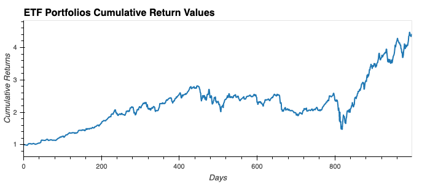

# ETF Investing
## Exchange-Traded Fund

This notebook offers a web application by using SQL to analyze the performance of an example Exchange-Traded Fund. ETF's save investors time from researching individual stocks or companies and eliminate the risk of investing ina single stock. We will analyze the daily returns of the ETF stocks both individually and collectively, optimize the data with advanced SQL Queries, and deploy the notebook as a web application.



---

## Technologies

This project uses a Jupyter Notebook in Jupyter Lab with the following libraries:

- Pandas: to help with the robust amount of features that will help analyze and organize the data.
- SQLAlchemy: to manage and analyze data that’s in databases and to create a dataframe out of SQL Queries.  
- NumPy: to support large, multidimentional arrays
- PyViz & hvPlot: to create interactive data visualizations that are visually pleasing to the audience


---

## Usage

To succesfully run this notebook, please be sure to import the required libraries and dependencies:

```
import numpy as np
import pandas as pd
import hvplot.pandas
import sqlalchemy
```

---

## Contributors

Michael Husary was the main contributer along with fellow classmates and the educational staff. 

--- 

## License
*(Not sure if a license was required on this Challenge)*


MIT